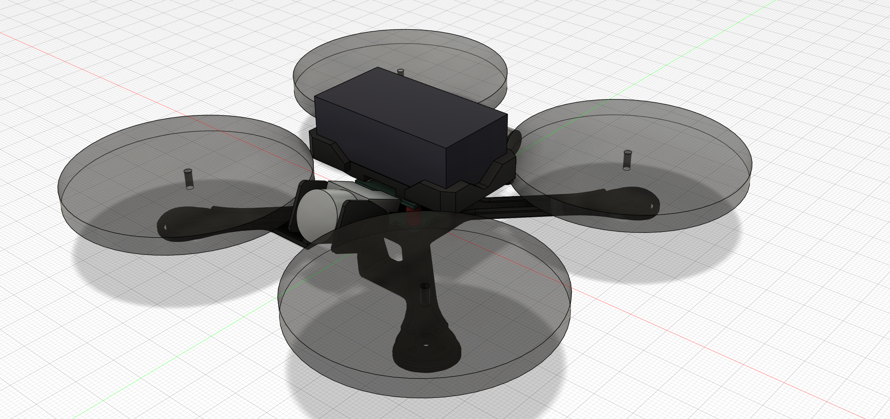
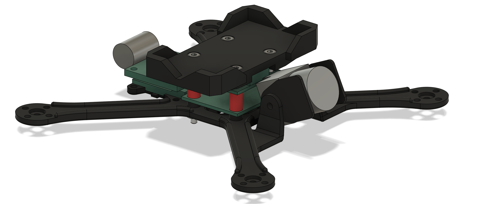
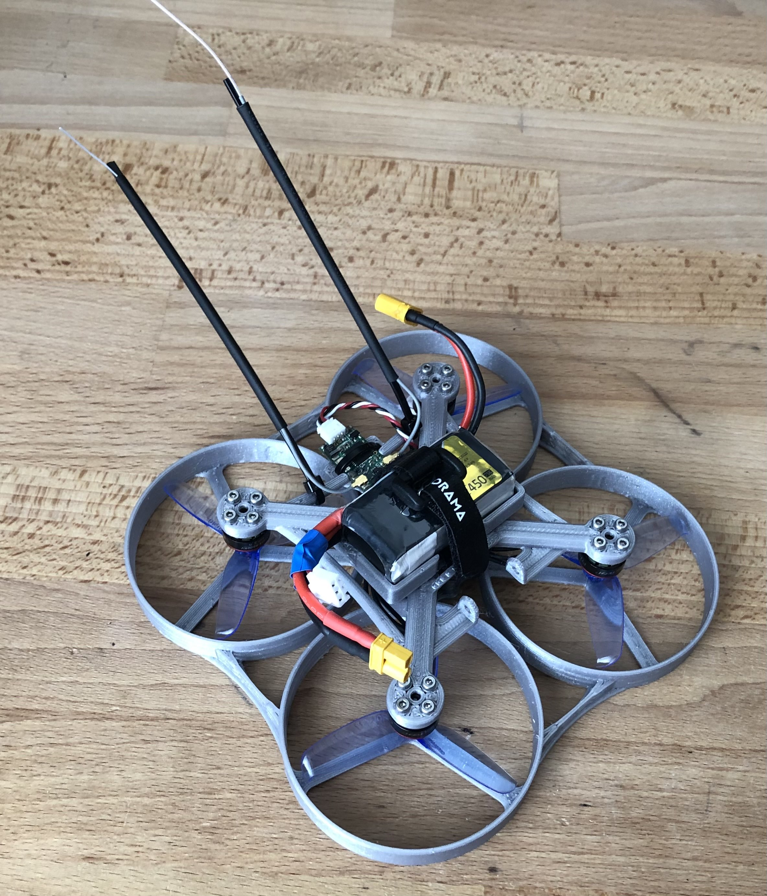
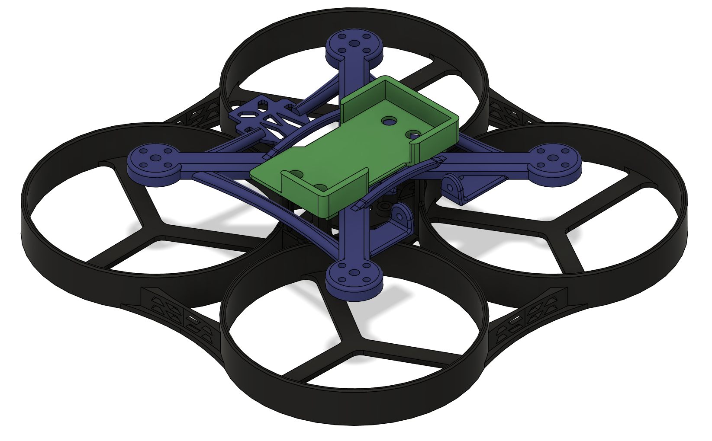
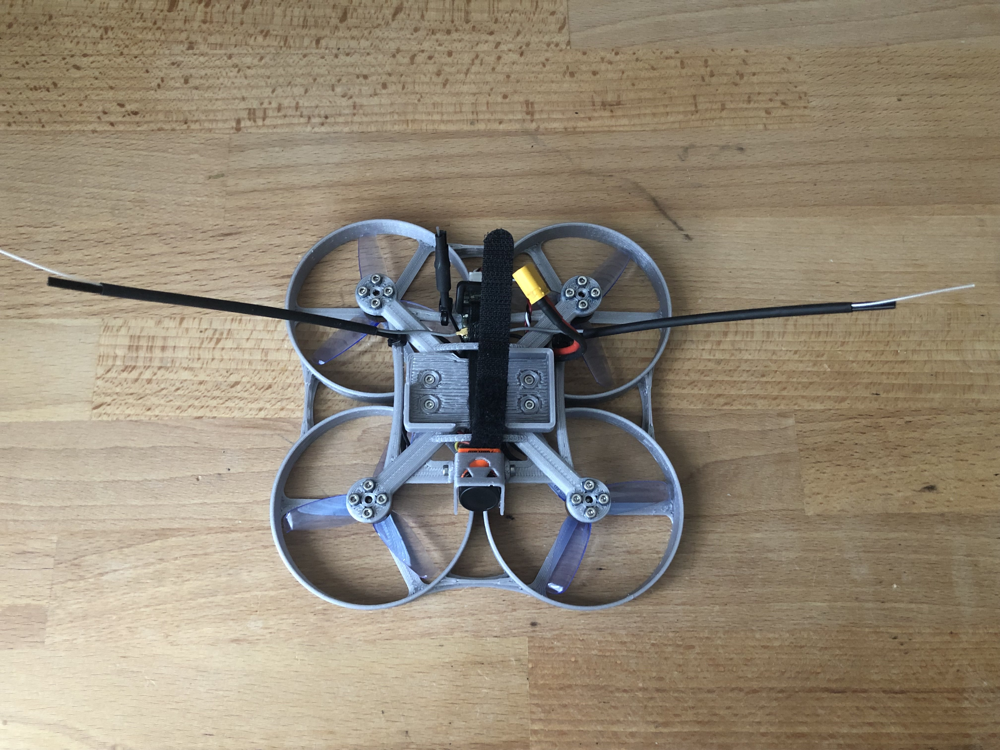
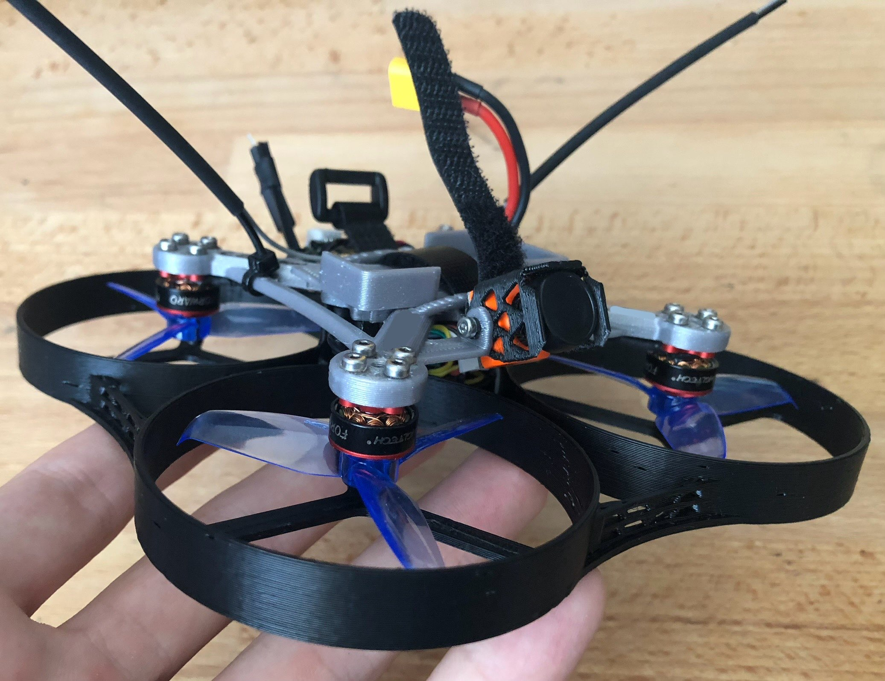

# My projects :

# Drone

https://github.com/user-attachments/assets/e63e6808-878c-4063-ad3e-72dc07e14a80

The idea to make a drone came from Prusa's video about how to build a 3D printed drone. The electronics that I had for it unfortunately had mounting holes at the wrong place for the frame that Prusa had made available for download. I thus decided to adapt Prusa's frame to fit my components. While doing that, I discovered that my motors wouldn't fit onto the drone arms, so I made the decision to design an entirely new frame on my own. The layout was to be the same as Prusa's, with propellers above the motors and the battery on top of the frame.\
My main objectives were to have the most compact and light drone as possible, while having to buy the least amount of additional parts. I ended up doing four versions of the drone, as I came up with ideas that involved major redesigns multiple times. The first version to fly was the V3, with the V4 being a studier version the V3.\
The V5 will have a redesigned bottom frame to ease up its replacement after crashes.
## V2
View of the drone with propellers and the battery in Autodesk Fusion

Another view of that version, this time without the propellers and the battery

## V3 
Drone on the day of the first (indoor) test flight

## V4
The three 3D printed parts on the drone in Fusion

Version 4 seen from underneath

Same version but the bottom frame is now made out of PETG, which, by being more flexible, should be able to withstand more impacts compared to a more brittle PLA frame.

# Mechanical system to simulate recoil on electric airsoft replicas 
WIP
