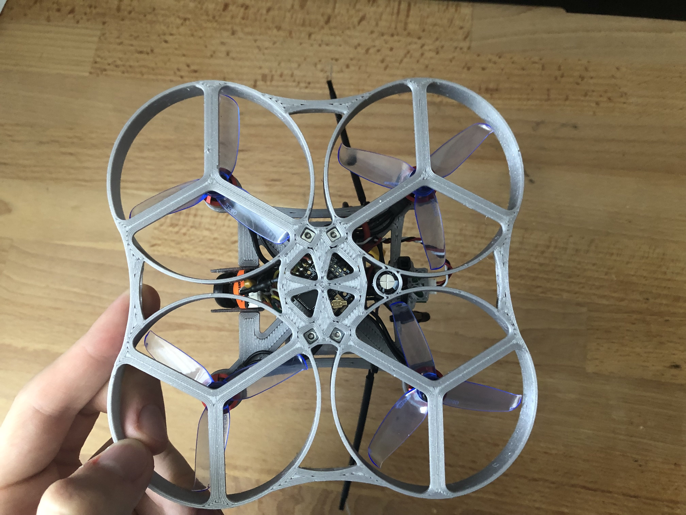

# My projects :

# Drone
The idea to make a drone came from Prusa's video about how to build a 3D printed drone. The electronics that got bought for it had unfortunately the mounting holes at the wrong place for the frame that Prusa had made available for download. I thus decided to adapt Prusa's frame as to fit my components, while doing so, I discovered that my motors would fit into the drone arms, so I made the decision to design an entirely new frame on my own.  The layout was to be the same as Prusa's, propellers above the motors, battery on top of the frame.\
My main objectives were to have the most compact and light drone as possible. I ended up doing four versions of the drone, as I came up with ideas that involved major redesigns multiple times. The first version to fly was the V3, with the V4 being a much studier version the V3.
## V2
View of the drone with propellers and the battery

Another view of that version, this time without the propellers and the battery

## V4

